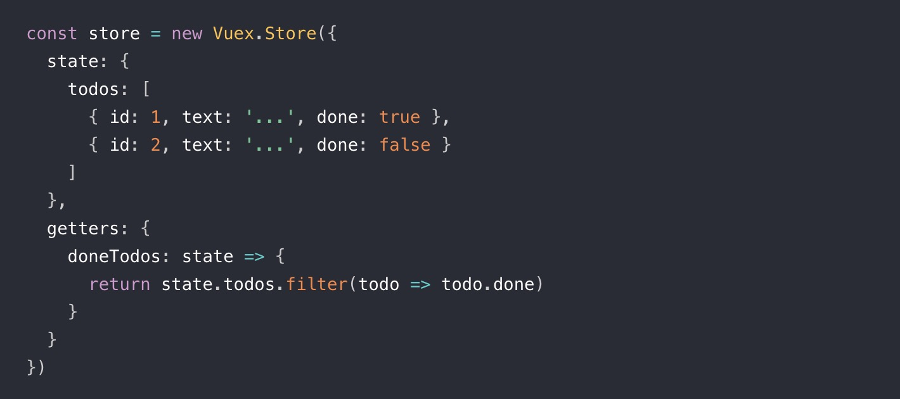
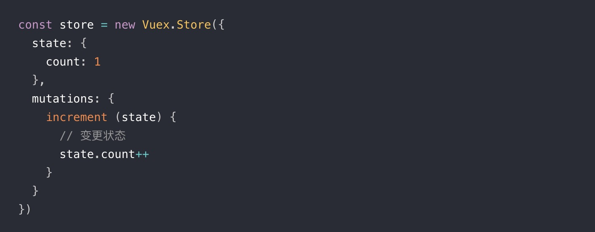
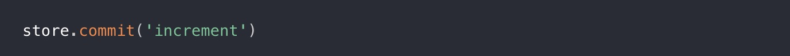
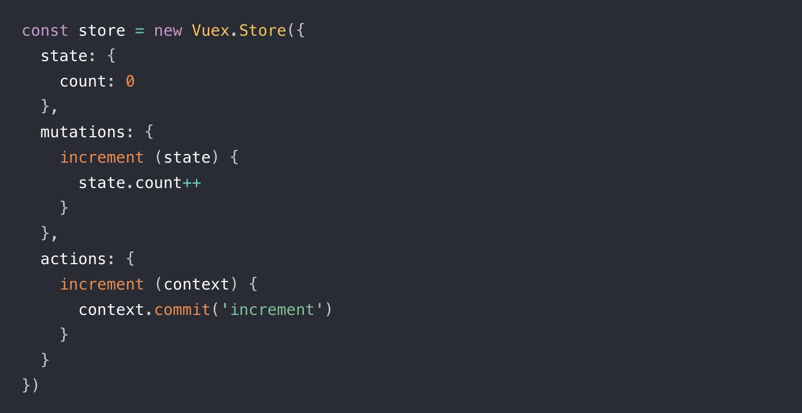
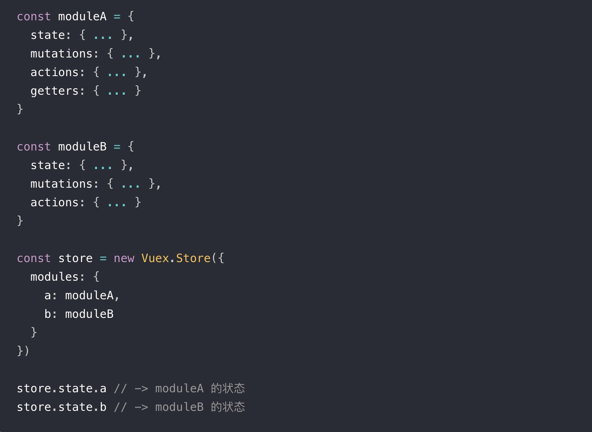
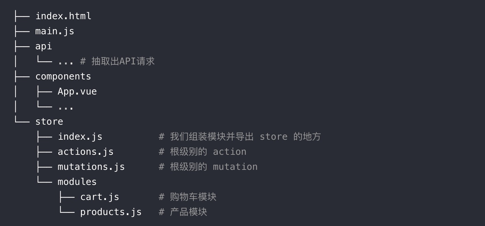

## 概念
Vuex是一个专门为Vue.js应用程序开发的状态管理模式。

## 为什么要用vuex?
当我们构建一个大中型的单页面应用程序时，Vuex可以更好的帮助我们在组件外部统一管理状态。

## Vuex核心概念
- State(唯一数据源，单一状态树)

- Getters（通过Getters可以派生出一些新的状态）

- Mutation

  更改Vuex的store中的状态的唯一方法是提交mutation.

- Action
  - Action提交的是mutation，而不是直接变更状态。
  - Action可以包含任意异步操作。
  
- Modules

  面对复杂的应用程序，当管理的状态比较多时，我们需要将Vuex的store对象分割成模块。
    

## 项目结构
  

